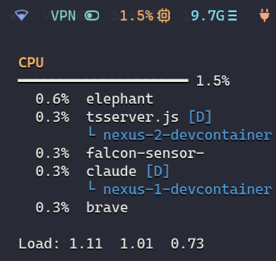
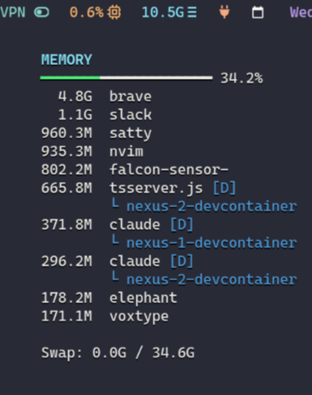

# waybar-top-cpu-mem

Custom Waybar modules that show CPU and memory usage with rich tooltips.

- **Per-process breakdown** - see which processes are actually eating your CPU and memory, right in the bar tooltip
- **Docker-aware** - detects containerized processes and shows the container name
- **Smart process names** - resolves unhelpful names like `MainThread`, Nix wrappers, and generic interpreters to the real application

## Screenshots

### CPU



### Memory



The usage bar is colored green for the filled portion. Titles, values, and icons are colored per module configuration. Docker containers are highlighted with `[D]` and show the container name below the process.

## How it works

### CPU

CPU usage is normalized across all cores to a 0-100% scale (matching tools like btop). The module runs `top` in batch mode and `ps` together to both measure CPU percentages and resolve process names.

### Memory

Memory is aggregated per process name using RSS from `ps`. Multiple instances of the same process (e.g. browser tabs) are summed together.

### Process name resolution

Both modules handle cases where the reported process name is unhelpful:

- `MainThread` (Python apps) - resolved from the command line
- `.foo-wrapped` / `.foo-wrap` (Nix wrappers) - resolved to the actual binary name
- Generic interpreters (`node`, `python`, `bash`, etc.) are skipped in favor of the actual script/app name

### Docker detection

Processes running inside Docker containers are detected via cgroup membership and tagged with `[D]` in the tooltip. The container name is shown below the process.

## Installation

Clone the repo wherever you like:

```bash
git clone https://github.com/twiking/waybar-top-cpu-mem.git ~/Dev/waybar-top-cpu-mem
```

Add the modules to your `~/.config/waybar/config.jsonc`:

```jsonc
"modules-right": [
  "custom/top-cpu",
  "custom/top-memory",
  // ...
],

"custom/top-cpu": {
  "exec": "/path/to//waybar-top-cpu-mem/top-cpu.sh",
  "return-type": "json",
  "interval": 3,
  "format": "{}",
  "tooltip": true,
  "icon": "",
  "color": "#ffb86c",
},
"custom/top-memory": {
  "exec": "/path/to//waybar-top-cpu-mem/top-memory.sh",
  "return-type": "json",
  "interval": 3,
  "format": "{}",
  "tooltip": true,
  "icon": "",
  "color": "#8be9fd",
},
```

Restart Waybar to apply.
